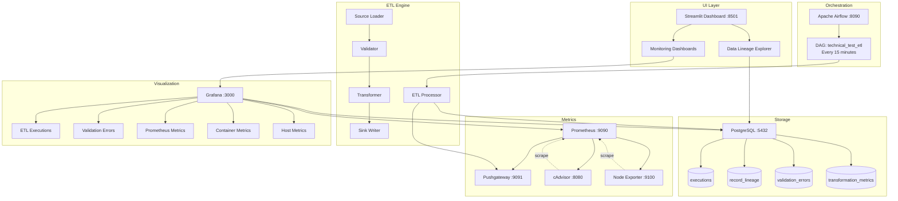
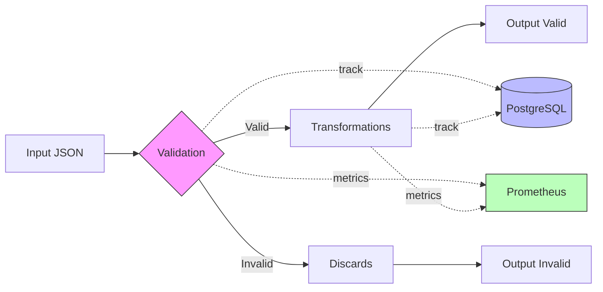
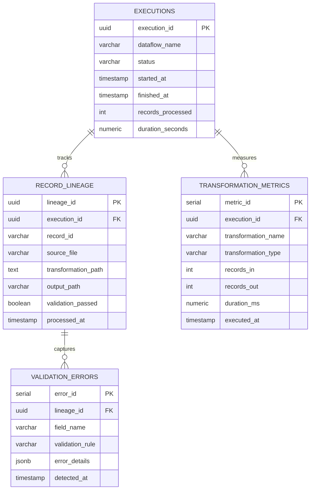

# ETL Observability Platform

Metadata-driven ETL framework with comprehensive observability and interactive monitoring dashboard.

**Stack:** Python 3.12 | Apache Airflow | PostgreSQL | Prometheus | Grafana | Streamlit

---

## Quick Start

### Prerequisites
- Docker & Docker Compose
- 8GB RAM minimum
- Ports: 5432, 8090, 8501, 3000, 9090, 9091, 8080, 9100

### Setup

```bash
git clone <repository-url>
cd sdg-etl-project

cp .env.example .env
chmod -R 777 data/output/

docker-compose up -d
```

Wait 60 seconds for initialization.

### Access

| Service | URL | Credentials |
|---------|-----|-------------|
| **Streamlit** | http://localhost:8501 | - |
| Airflow | http://localhost:8090 | admin/admin |
| Grafana | http://localhost:3000 | admin/admin |
| Prometheus | http://localhost:9090 | - |

---

## Architecture



---

## Data Flow



---

## Usage

### 1. Execute ETL

**Via Airflow:**
1. Open http://localhost:8090
2. Enable DAG: `technical_test_etl`
3. Trigger execution

ETL runs automatically every 15 minutes, generating 200 new records per execution.

### 2. Track Data Lineage

**Streamlit → Data Lineage tab:**
- Search by record ID or name
- View complete journey: source → validation → transformation → output
- Inspect validation errors and applied transformations

### 3. Monitor System

**Streamlit → Monitoring tab:**
- **ETL Executions** - Success rates, performance trends
- **Validation Errors** - Error analysis by field and type
- **Prometheus** - Real-time ETL metrics
- **Containers** - Docker resource usage (cAdvisor)
- **Host** - Server-level metrics (Node Exporter)

---

## Configuration

### Metadata Structure

ETL pipelines are defined declaratively in `config/metadata.json`:

```json
{
  "dataflows": [{
    "name": "dataflow-name",
    "sources": [{
      "name": "input_data",
      "path": "/data/input/events/person/*",
      "format": "JSON"
    }],
    "transformations": [
      {
        "name": "validation",
        "type": "validate_fields",
        "params": {
          "input": "input_data",
          "validations": [
            {"field": "email", "validations": ["notEmpty"]},
            {"field": "age", "validations": ["notNull"]}
          ]
        }
      },
      {
        "name": "add_metadata",
        "type": "add_fields",
        "params": {
          "input": "validation_ok",
          "addFields": [
            {"name": "processed_at", "function": "current_timestamp"}
          ]
        }
      }
    ],
    "sinks": [
      {
        "input": "add_metadata",
        "name": "valid-output",
        "paths": ["/data/output/events/person"],
        "format": "JSON",
        "saveMode": "OVERWRITE"
      },
      {
        "input": "validation_ko",
        "name": "invalid-output",
        "paths": ["/data/output/discards/person"],
        "format": "JSON",
        "saveMode": "APPEND"
      }
    ]
  }]
}
```

### Available Rules & Functions

**Validation:**
- `notNull` - Field must have a value
- `notEmpty` - Field cannot be empty string or array

**Functions:**
- `current_timestamp` - Current date/time
- `uuid` - Unique identifier

### Extending

Add custom validation in `etl_engine/transformations.py`:

```python
VALIDATION_RULES = {
    "notNull": lambda value: value is not None,
    "notEmpty": lambda value: value not in [None, "", []],
    "isEmail": lambda value: "@" in str(value) if value else False,
}
```

---

## Project Structure

```
sdg-etl-project/
├── etl_engine/              # Core ETL framework
│   ├── processor.py         # Main orchestrator
│   ├── transformations.py   # Validation & transform
│   ├── source_loader.py     # Data ingestion
│   ├── sink_writer.py       # Output writer
│   └── models.py            # Pydantic schemas
├── observability/
│   ├── db/                  # PostgreSQL operations
│   ├── lineage/             # Record tracking
│   └── metrics/             # Prometheus collectors
├── dags/
│   └── etl_dag.py          # Airflow DAG
├── streamlit_tabs/
│   ├── tab1_lineage.py     # Lineage UI
│   └── tab2_monitoring.py  # Monitoring UI
├── grafana/provisioning/
│   ├── datasources/        # PostgreSQL + Prometheus
│   └── dashboards/         # 5 pre-configured dashboards
├── config/
│   └── metadata.json       # ETL configuration
├── data/
│   ├── input/              # Source data
│   └── output/             # Valid + invalid records
├── streamlit_app.py        # Main UI
├── streamlit_db.py         # Database queries
├── docker-compose.yaml     # Infrastructure
└── requirements.txt
```

---

## Observability Schema



---

## Prometheus Metrics

```promql
# Records processed by dataflow
etl_records_processed_total{dataflow="prueba-acceso"}

# Success rate
etl_records_valid_total / etl_records_processed_total

# P95 execution duration
histogram_quantile(0.95, rate(etl_execution_duration_seconds_bucket[5m]))

# Transformation performance
rate(etl_transformation_duration_seconds_sum[5m]) / 
rate(etl_transformation_duration_seconds_count[5m])
```

---

## Troubleshooting

### Services not starting
```bash
docker-compose logs -f [service-name]
docker-compose restart [service-name]
```

### Empty dashboards
- Wait 2-3 minutes for metric accumulation
- Trigger DAG manually: Airflow UI → `technical_test_etl` → Play button
- Verify Prometheus targets: http://localhost:9090/targets (all should be UP)

### Connection errors
```bash
# Test PostgreSQL
docker exec postgres psql -U airflow -d airflow -c "SELECT 1;"

# Check service status
docker-compose ps
```

### Port conflicts
```bash
# Find process using port
sudo lsof -i :8501

# Stop and restart
docker-compose down
docker-compose up -d
```

---

## Local Development

```bash
# Activate virtual environment
source .venv/bin/activate

# Run ETL locally
python scripts/run_etl.py

# Run Streamlit locally
streamlit run streamlit_app.py
```

---

## Production Considerations

- Change all default passwords in `.env`
- Enable SSL/TLS for PostgreSQL and Grafana
- Configure proper authentication (LDAP/OAuth)
- Use CeleryExecutor in Airflow for horizontal scaling
- Set up automated database backups
- Configure Grafana alerting rules
- Implement log aggregation (ELK/Loki)
- Add API rate limiting

---

**Technical Assessment - SDG Group**

*Senior Data Engineer Position | October 2025*