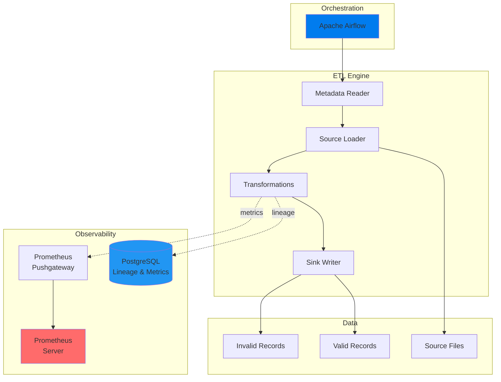
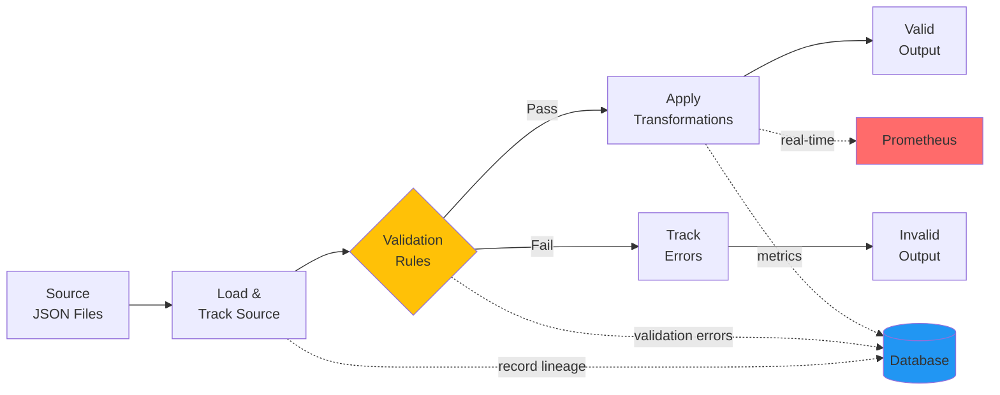
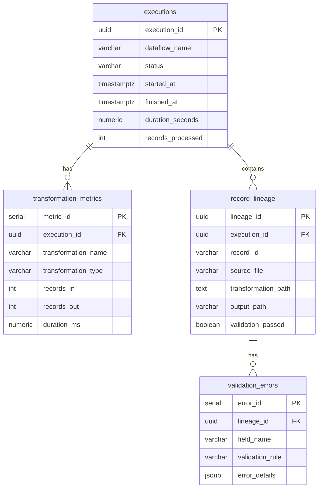

# Metadata-Driven ETL Engine

Enterprise-grade ETL framework with comprehensive observability, real-time monitoring, and complete data lineage tracking.

---

## Overview

Flexible ETL engine that processes data based on JSON metadata configuration, providing:

- **Metadata-driven execution** - Define sources, transformations, and outputs in JSON
- **Complete data lineage** - Track every record from source to destination
- **Real-time metrics** - Monitor execution performance with Prometheus
- **Orchestration** - Schedule and manage workflows with Apache Airflow
- **Field-level validation** - Extensible validation rules with detailed error tracking

---

## Architecture


---

## Data Flow


---

## Database Schema


---

## Quick Start

### Prerequisites

- Docker & Docker Compose
- 8GB RAM minimum

### Installation
```bash
# Clone repository
git clone <repository-url>
cd sdg-etl-project

# Set permissions
chmod -R 777 data/output/

# Start services
docker-compose up -d

# Wait for services to initialize (~30 seconds)
docker-compose ps
```

### Access Points

| Service | URL | Credentials |
|---------|-----|-------------|
| Airflow | http://localhost:8090 | admin / admin |
| Prometheus | http://localhost:9090 | - |
| Pushgateway | http://localhost:9091 | - |

### Execute ETL

1. Open Airflow UI at `http://localhost:8090`
2. Enable DAG: `technical_test_etl`
3. Trigger execution
4. Monitor progress in real-time

---

## Configuration

### Metadata Structure

ETL behavior is defined in `config/metadata.json`:
```json
{
  "dataflows": [{
    "name": "dataflow-name",
    "sources": [{
      "name": "source-name",
      "path": "/data/input/path/*",
      "format": "JSON"
    }],
    "transformations": [{
      "name": "transformation-name",
      "type": "validate_fields | add_fields",
      "params": { }
    }],
    "sinks": [{
      "input": "dataset-name",
      "name": "sink-name",
      "paths": ["/data/output/path"],
      "format": "JSON",
      "saveMode": "OVERWRITE | APPEND"
    }]
  }]
}
```

### Validation Rules

| Rule | Description |
|------|-------------|
| `notNull` | Field must have a value (not null) |
| `notEmpty` | Field must not be empty string or empty array |

### Field Functions

| Function | Description |
|----------|-------------|
| `current_timestamp` | Adds current timestamp in `YYYY-MM-DD HH:MM:SS` format |

### Extending Validation Rules

Add new rules in `etl_engine/transformations.py`:
```python
VALIDATION_RULES = {
    "notNull": lambda value: value is not None,
    "notEmpty": lambda value: value not in [None, "", []],
    "isEmail": lambda value: "@" in str(value) if value else False,
}
```

### Extending Field Functions

Add new functions in `etl_engine/transformations.py`:
```python
FIELD_FUNCTIONS = {
    "current_timestamp": lambda: datetime.now().strftime("%Y-%m-%d %H:%M:%S"),
    "uuid": lambda: str(uuid.uuid4()),
}
```

---

## Project Structure
```
sdg-etl-project/
├── etl_engine/              # Core ETL framework
│   ├── processor.py         # Main orchestrator
│   ├── source_loader.py     # Data ingestion
│   ├── transformations.py   # Validation & transformation logic
│   ├── sink_writer.py       # Output writer
│   ├── metadata_reader.py   # Configuration parser
│   ├── models.py            # Data models (Pydantic)
│   └── exceptions.py        # Custom exceptions
├── observability/
│   ├── db/
│   │   ├── connection.py    # Connection pool management
│   │   ├── queries.py       # Database operations
│   │   └── schema.sql       # Schema definitions
│   ├── lineage/
│   │   └── tracker.py       # Record lineage tracking
│   └── metrics/
│       ├── collectors.py    # Prometheus metrics
│       └── exporter.py      # Pushgateway integration
├── dags/
│   └── etl_dag.py          # Airflow DAG
├── config/
│   └── metadata.json       # ETL configuration
├── data/
│   ├── input/              # Source data
│   └── output/             # Processed data
├── docker-compose.yaml     # Infrastructure definition
├── prometheus.yml          # Prometheus configuration
└── requirements.txt        # Python dependencies
```

---

## Monitoring

### Prometheus Metrics
```promql
# Records processed
etl_records_processed_total

# Success rate
etl_records_valid_total / etl_records_processed_total

# Execution duration (p95)
histogram_quantile(0.95, rate(etl_execution_duration_seconds_bucket[5m]))

# Transformation performance
rate(etl_transformation_duration_seconds_sum[5m]) / 
rate(etl_transformation_duration_seconds_count[5m])
```

### Database Queries
```sql
-- Recent executions
SELECT execution_id, dataflow_name, status, duration_seconds, records_processed
FROM observability.executions
ORDER BY started_at DESC
LIMIT 10;

-- Validation errors summary
SELECT field_name, validation_rule, COUNT(*) as error_count
FROM observability.validation_errors
GROUP BY field_name, validation_rule
ORDER BY error_count DESC;

-- Record lineage lookup
SELECT * FROM observability.record_lineage
WHERE record_id = 'specific-record-id';
```

---

## Technology Stack

| Component | Technology | Version |
|-----------|-----------|---------|
| Runtime | Python | 3.12 |
| Orchestration | Apache Airflow | 2.10.3 |
| Database | PostgreSQL | 15 |
| Metrics | Prometheus | latest |
| Metrics Gateway | Pushgateway | latest |
| Containerization | Docker Compose | 3.8 |
| Data Validation | Pydantic | 2.9.2 |
| Database Driver | psycopg2-binary | 2.9.9 |
| Metrics Client | prometheus-client | 0.20.0 |

---

## Design Principles

### Functional Architecture
Stateless transformations enable easy testing and composition.

### Metadata-Driven
Single configuration file controls all ETL behavior without code changes.

### Observability-First
Every record tracked, every transformation measured, every error captured.

### Extensibility
Add validation rules and field functions without modifying core engine.

### Separation of Concerns
Clear boundaries between ingestion, transformation, output, and observability.

---

## Performance

- **Connection Pooling**: 2-10 reusable database connections
- **Batch Processing**: Efficient handling of large datasets
- **Async Metrics**: Non-blocking metrics collection
- **Optimized I/O**: Minimal file operations

